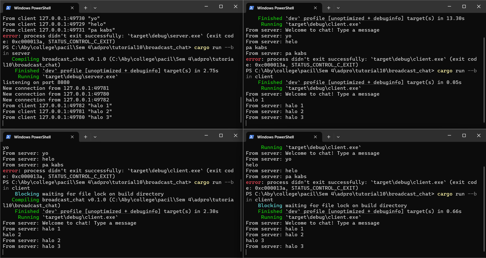

# Tutorial 10 - Asynchronous Programming - Timer
**Emanuella Abygail - 2306152185**

## Original Code

Pada gambar di atas, terlihat bahwa ketika satu client mengirim pesan dan server menerima pesan tersebut, clint-client lainnya juga mendapatkan pesan itu. Hal ini terjadi karena client dan server tersambung melalui websocket sehingga server akan melanjutkan pesan yang diterima oleh salah satu client ke client-client lainnya.

## Modifying Port

Terlihat bahwa program tetap berjalan dengan baik. Hal ini terjadi karena kita mengubah port di client dan server. Jika kita hanya mengubah port di salah satu dan port di client berbeda dengan port di server, program akan error karena client dan server tidak terhubung. Oleh karena itu, kita harus memastikan bahwa port pada server dan client sama.