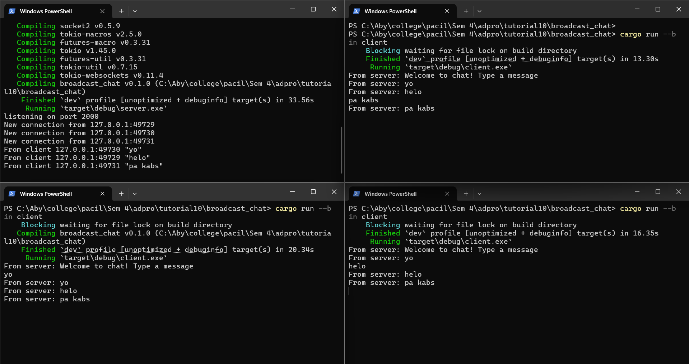

# Tutorial 10 - Asynchronous Programming - Timer
**Emanuella Abygail - 2306152185**

## Original Code

Pada gambar di atas, terlihat bahwa ketika satu client mengirim pesan dan server menerima pesan tersebut, clint-client lainnya juga mendapatkan pesan itu. Hal ini terjadi karena client dan server tersambung melalui websocket sehingga server akan melanjutkan pesan yang diterima oleh salah satu client ke client-client lainnya.